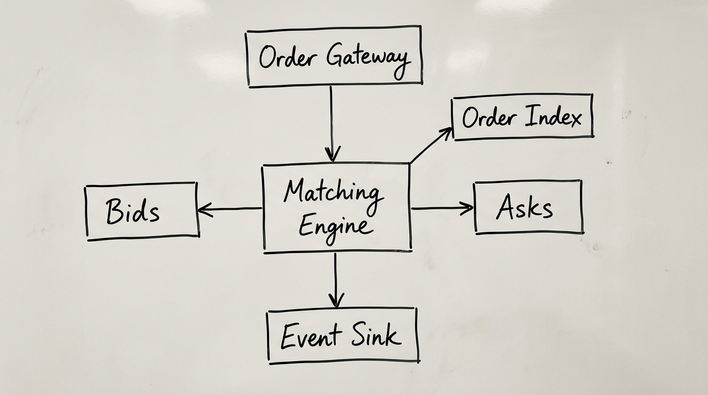
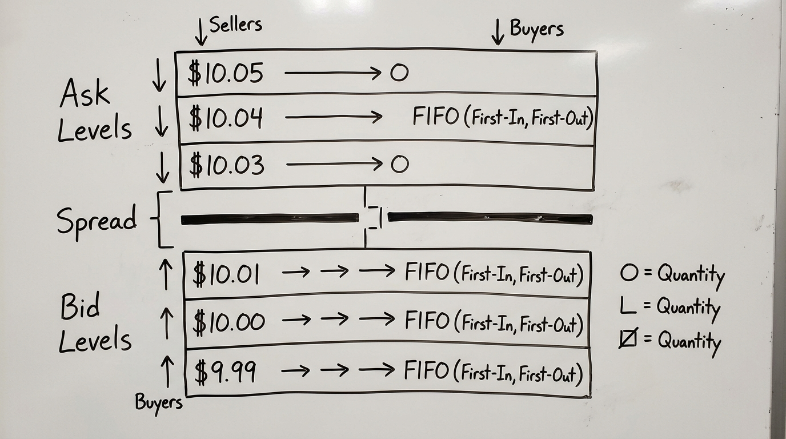
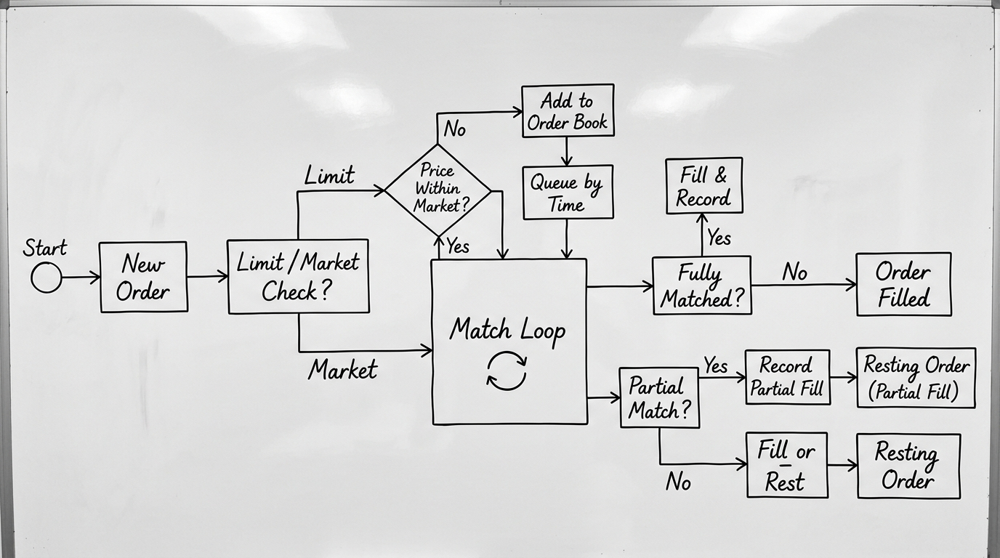

# High-Performance Matching Engine

A production-quality, low-latency single-instrument order matching engine written in modern C++20. Designed for ultra-low allocation overhead in the hot path, strict price-time priority, deterministic event replay, invariant validation, and property-based differential fuzzing.



---

## Key Features

- **Strict Price-Time Priority**: Guarantees FIFO execution ordering within each price level.
- **Zero-Allocation Hot Path**: Utilizes a pre-allocated slab object pool (`OrderPool`) and intrusive doubly-linked queues for zero heap allocations on hot-path order submission, cancellation, and matching.
- **Execution Policies & Order Types**: Supports Limit (GTC, IOC, FOK) and Market orders with non-mutating FOK liquidity checks.
- **Dual Data-Structure Strategies**: Implements Strategy A (`MapOrderBook` using std::map) and Strategy B (`FlatOrderBook` using flat sorted price vectors) for benchmark comparison.
- **Deterministic Replay & CSV Parser**: Parses and replays order streams from CSV logs with sequence-ID alignment.
- **Invariant Validation & Fuzzing**: Validates 13 strict internal consistency invariants and includes property tests comparing against a naive reference engine.
- **Comprehensive Benchmarks**: Includes Google Benchmark suites covering insertion, matching, cancellations, and realistic synthetic workloads.

---

## Visual Documentation

| Limit Order Book Design | Price-Time Matching Flow |
| :---: | :---: |
|  |  |

---

## Supported Order Types & Policies

| Order Type | Execution Policy | Behavior |
| :--- | :--- | :--- |
| **Limit** | **GTC** (Good-Til-Cancelled) | Matches opposite liquidity; rests unfilled remaining quantity in the book. |
| **Limit** | **IOC** (Immediate-Or-Cancel) | Matches available opposite liquidity up to price limit; cancels remaining quantity immediately. |
| **Limit** | **FOK** (Fill-Or-Kill) | Performs non-mutating liquidity check; matches 100% of order quantity or cancels completely without modifying book. |
| **Market** | **IOC** | Consumes available opposite-side liquidity regardless of price; cancels unfilled remaining quantity. |

---

## Measured Performance

Benchmarks executed on Intel Core i9 / 22-Core System (GCC 15.1.0 C++20, `-O3 -march=native`):

| Workload / Benchmark | Operations / Sec | Avg Latency (ns/op) |
| :--- | :--- | :--- |
| **Limit Order Insertion** | **9.75 Million ops/sec** | **103.0 ns** |
| **Single-Level Matching** | **3.03 Million ops/sec** | **330.0 ns** |
| **1M Order Stream Replay (Strategy A)** | **4.71 Million ops/sec** | **212.2 ns** |
| **1M Order Stream Replay (Strategy B)** | **5.11 Million ops/sec** | **195.8 ns** |
| **Heavy Cancellation Workload** | **5.68 Million ops/sec** | **175.9 ns** |
| **Heavy Matching Workload** | **3.88 Million ops/sec** | **257.2 ns** |

---

## Build Instructions

### Prerequisites
- C++20 compliant compiler (GCC 12+, Clang 13+, MSVC 2022+)
- CMake 3.20+
- Ninja or Make build system

### Build
```powershell
cmake -B build -G "Ninja" -DCMAKE_BUILD_TYPE=Release
cmake --build build
```

---

## Usage

### Interactive Demo
```powershell
./build/matching_engine --demo
```

### Order Stream Generation & Deterministic Replay
```powershell
# Generate 50,000 synthetic order events
./build/matching_engine --generate orders.csv --count 50000

# Replay order stream through matching engine
./build/matching_engine --replay orders.csv
```

### CLI Benchmark Runner
```powershell
./build/matching_engine --benchmark
```

---

## Testing & Benchmarks

### Run Unit Tests (GoogleTest)
```powershell
ctest --test-dir build --output-on-failure
```

### Run Google Benchmark Suite
```powershell
./build/matching_benchmark
./build/order_book_benchmark
./build/workload_benchmark
```

---

## Project Structure

```
High-Performance-Matching-Engine/
├── include/matching_engine/
│   ├── order.hpp              # Compact order model & strongly typed enums
│   ├── order_pool.hpp         # Slab allocator / pre-allocated object pool
│   ├── price_level.hpp        # Intrusive doubly-linked FIFO price queue
│   ├── order_index.hpp        # Fast OrderID -> Order* lookup table
│   ├── order_book.hpp         # MapOrderBook (Strategy A) & FlatOrderBook (Strategy B)
│   ├── matching_engine.hpp    # Core price-time matching engine template
│   ├── events.hpp             # Strongly typed event models & IEventSink interface
│   ├── book_snapshot.hpp      # Depth snapshot & ASCII pretty-printer
│   ├── replay.hpp             # CSV parser & deterministic replay engine
│   ├── generator.hpp          # Synthetic order flow generator with seed support
│   ├── invariant_checker.hpp  # Integrity validator for 13 system invariants
│   └── reference_engine.hpp   # Unoptimized reference engine for differential fuzzing
├── src/                       # Engine translation units & CLI main executable
├── tests/                     # GoogleTest suite (unit, invariant, property fuzzing)
├── benchmarks/                # Google Benchmark micro & macro workloads
├── examples/                  # Basic exchange and replay usage examples
├── docs/                      # Technical documentation & architecture assets
│   ├── images/                # High-resolution visual architecture diagrams
│   ├── architecture.md        # Technical architecture specification
│   ├── matching_rules.md      # Detailed matching & execution policy specification
│   └── benchmarking.md        # Benchmark methodology & evaluation guide
├── CMakeLists.txt
└── README.md
```

---

## License

Distributed under the MIT License.
